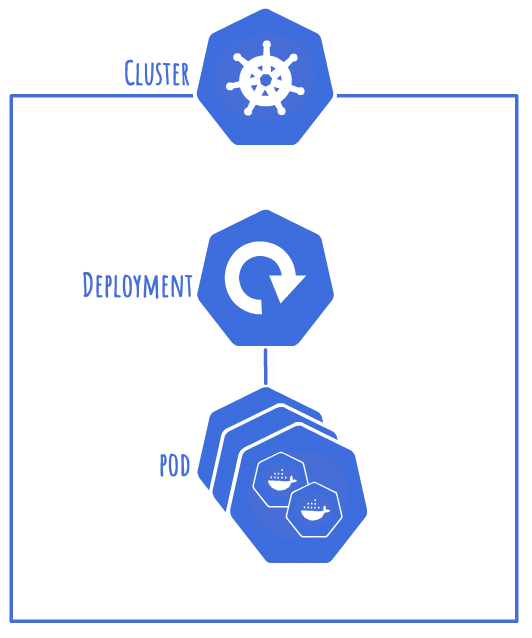

# 01 - Simple Application

A brief example of how to deploy a simple docker container with k8s.

The application we are deploying is a simple python website.

The custom image is deployed as a single container within a pod. The pod is then given its own deployment with the replica set configured for a single replica.


## Structure

Create a directory structure like below, feel free to clone the repo to get the containers or even create your own:
```
01-simple-application
|-- containers
|   `-- web
|       |-- app
|       |   `-- ...
|       `-- Dockerfile
|-- web.yml
`-- README.md
```

## Application

We will build the application into a docker image, although this could be any image in a remote registry.

It's a simple python application to display a webpage on `http/80`.


## web.yml

### Deployment

There are two parts to this simple application, the `deployment` and the `service`.

Using docker, we deploy containers. This changes in k8s as we never deploy a container directly, but we deploy a pod. A pod is the smallest unit that can be deployed in k8s, a pod usually contains a single continer.

Our pods will be part of a `deployment` and specified in a `template`.

This is also where we specify the number of replicas of a pod that will be deployed as part of the deployment.

```yaml
apiVersion: apps/v1
kind: Deployment
metadata:
  name: web-deployment
spec:
  replicas: 1
  selector:
    matchLabels:
      component: web-label
  template:
    metadata:
      labels:
        component: web-label
    spec:
      containers:
        - name: web-container
          image: mrmcshane/web
          ports:
            - containerPort: 80
```


### Service

A `service` assigns networking to a set of pods.

#### Service Types

We will be using `type: NodePort`, as it allows direct access to the service from outside the cluster.

##### Selectors

```yaml
selector:
  component: web-label
```

`Selectors` are used to specify which pods traffic is routed to. These select the `labels` assigned to a pod.

#### Port Mapping

```yaml
ports:
- port: 80
    targetPort: 80
    nodePort: 30001
```
Services also control the port mapping from outside the pod to inside the pod through 3 settings:

- **port:** access within the cluster
- **targetPort:** access within the pod
- **nodePort:** access from external


## Deploying the application

Build web image:
```shell
docker build containers/web -t mrmcshane/web
```

Push custom image to dockerhub:
```shell
docker push mrmcshane/web
```

Apply the deployment file:
```shell
kubectl apply -f web.yml
```

## Test the application

Test the application is online:
```
http://{minikube-ip}:30001
```

To see how your environment looks, you can visit the minikube dashboard:
```
minikube dashboard
```

## Scale the application

One of the key features of kubernetes is the ability to scale easily without having to do a full redeploy.

We will scale our application to 3 instances, or replicas. This is done by updating `replicas: 1` from within the deployment configuration block to `replicas: 3`.

**Note:** Replicas in English implies a copy, so if you had one replica of an object you would imagine you would have 2 of an object. This is not the case in kubernetes, 2 replicas means 2 instances of an object.

Once you have updated the number of replicas in the manifest, you can apply the changes:

```
kubectl apply -f web.yml
```

This should update the number of pods to 3. You can see this on the updated logical diagram:

