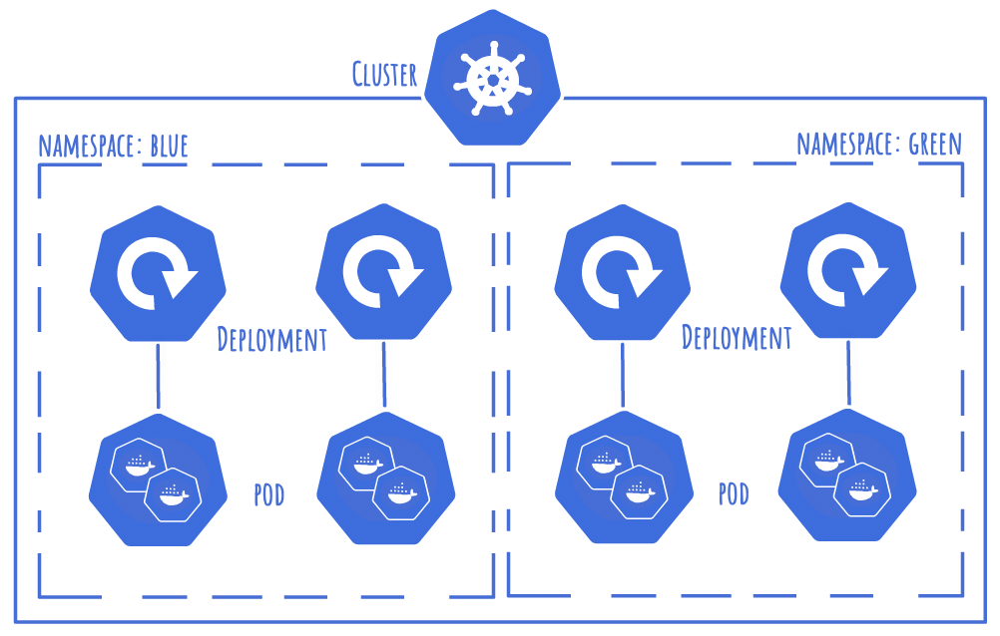

# Namespaces

The source for this can be found on [github](https://github.com/valtech-uk/kubernetes-training/tree/master/04-namespaces).

Namespaces are a way to seperate your cluster into virtual clusters.

We will be deploying two modified versions of the stateful application, each in a different namespace.



## Structure

Your directory structure should look something like this:
```
04-namespaces
|-- containers
|   `-- python
|       |-- app
|       |   `-- ...
|       `-- Dockerfile
|-- deployment-blue.yml
`-- deployment-green.yml
```
The deployment files for mariadb and python have been merged into the same config files, one for each namespace (blue/green).


## Python Application


Like in [03-stateful-application](https://github.com/valtech-uk/kubernetes-training/tree/master/03-stateful-application), we are testing connectivity with a simple database connection string. However this time, each python application in both namespaces will be configured with two connection strings:
```shell
host="mariadb-clusterip.blue"
host="mariadb-clusterip.green"
```

This allows us to cross namespaces if needed to access resources outside of our current namespace.

If the namespaces need to be segregated, you would only need this connection string in boeachth namespace deployment:
```shell
host="mariadb-clusterip"
```
Without explicitly stating the namespace for the resource, an application will only be able to reference resources within its own namespace.


## Namespace Decleration

To create a namespace, it's a simple declaration:
```yaml
apiVersion: v1
kind: Namespace
metadata:
  name: blue
```

## Namespace Assignment

To assign a resource to a namespace, it's just a case of adding a `namespace` key to the metadata of a resource:
```yaml
apiVersion: v1
kind: ConfigMap
metadata:
  name: mariadb-config
  namespace: blue
```


## Deploying the application

It's a simple `apply` to deploy the applications:
```shell
kubectl apply -f deployment-blue.yml
kubectl apply -f deployment-green.yml
```


## Testing

To test this is working, bring up only one of the namespace deployments and visit the application, then bring the second and watch the application connect.

Blue
```
http://{minikube-ip}:30041
```
Green:
```
http://{minikube-ip}:30042
```


## Note

This link helped me:

- [Kubernetes best practices: Organizing with Namespaces](https://cloud.google.com/blog/products/gcp/kubernetes-best-practices-organizing-with-namespaces)
