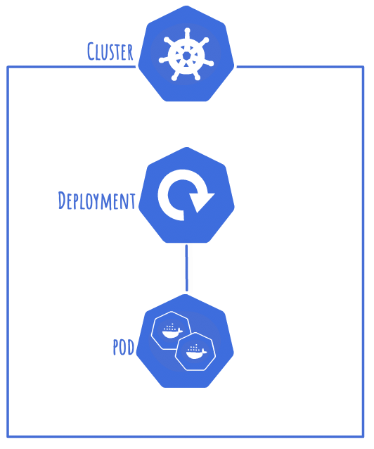
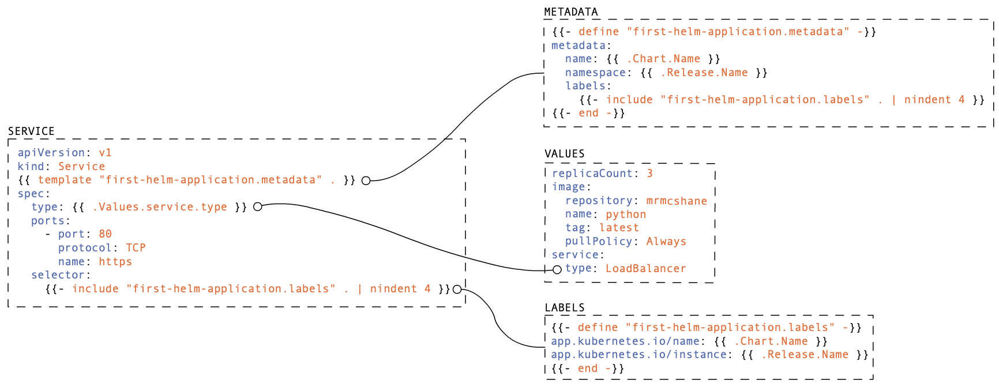

# Helm Template

The source for this can be found on [github](https://github.com/mrmcshane/k8s-training/tree/master/05-helm-template).

Helm is a tool to package, template, and release kubernetes manifests. 
Combined with Tiller, it can roll out updated versions of applications and check the status of the new deployment before removing the previous version.

In this excersize we will be using the Helm Template functionality, not the functionality that relies on Tiller, as it requires applying a cluster role that is generally considered insecure.

This will be deploying a very simple application, a single pod using a single deployment much like the first excersize:



## Structure

Your directory structure should look something like this:
```
05-helm-template
|-- templates
|   |-- deployment.yaml
|   |-- labels.yaml
|   |-- metadata.yaml
|   `-- service.yaml
|-- .helmignore
|-- Chart.yml
|-- README.md
`-- values.yml
```

The `templates` are essentially kubernetes manifest snippets with some extra template functionality such as variables and includes.

`Chart.yaml` is the metadata for your chart.

`values.yml` is the custom variables that will be applied to your template. The idea is that this file is the only one that will be changed.

`.helmignore` is just like a `.gitignore`, it defines which files to ignore when building your manifest.


## Content

### Values

How we define and reference single variables or values in our templates.

#### Define Values

Values are specified in the `values.yaml` file, and can be defined in several ways:

Single value:
```yaml
replicaCount: 3
```

Structured values:
```yaml
image:
  repository: mrmcshane
  name: python
```

#### Include Values

As helm charts follow implement go templating, the template functionality is always inside a set of double curly braces: `{{ ... }}`.

To reference a value from the `values.yaml` file, we will specify `.Values.key`, where `key` is the yaml key:
```yaml
replicas: {{ .Values.replicaCount }}
```

Structured values can be referenced in the same way:
```yaml
image: {{ .Values.image.name }}
```


### Templates

How we define and re-use config snippets to eliminate duplicate code.

This example shows how the `service.yaml` manifest is built by including whole config blocks and referencing specific variables:



#### Define Template

```yaml
{{- define "first-helm-application.labels" -}}
...
{{- end -}}
```
Define the name of the template, in this case `first-helm-application.labels`.

This name will then be able to be referenced to include the config snippet in other areas of the manifest.


#### Include Template

```yaml
{{- include "first-helm-application.labels" . | nindent 8 }}
```
This includes the labels template in your current config.

The `-` at the beginning trims the leading whitespace and newline before the include, allowing you to move the variable to the right indentation in the code for readability.

`| nindent 8` indents the whole include 8 spaces in, `nindent` is used as opposed to `indent` as it adds the required newlines.


## Deployment

### Check Template

To check the template is valid, you can ask helm to build the template and output it to the console:
```shell
helm template . --name default
```

### Dry Run

Perform a dry run to ensure kubectl accepts the manifest, and the correct resource types are about to be created: 
```shell
helm template . --name default | kubectl apply -f - --dry-run
```

### Apply Helm Template

To apple this template to your cluster:
```shell
helm template . --name default | kubectl apply -f -
```

### Delete Helm Template

How to delete all items from the helm template from the kubernetes cluster:
```shell
helm template . --name default | kubectl delete -f -
```

### Command Breakdown

`helm template .`
Generate a single kubernetes manifest from your helm template.

`--name default`
Specify the namespace that you will use.

`| kubectl apply -f -`
Take the input from stdout and apply it to your kubernetes cluster.

`--dry-run`
Perform a kubectl dry run, display the resource types that will be created.


## Notes

[Helm Tips and Tricks](https://github.com/helm/helm/blob/master/docs/charts_tips_and_tricks.md) - More information on templating and indentation

