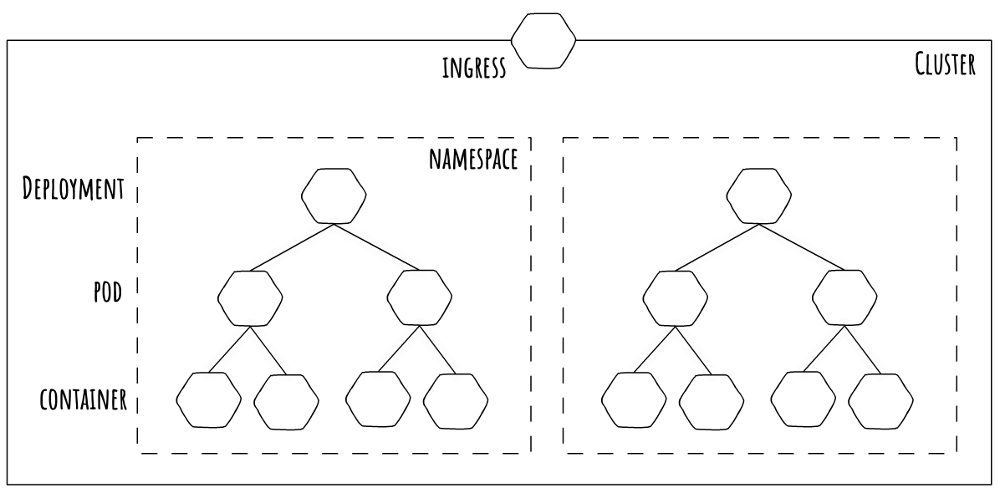

# Kubernetes Basics

**NOTE:** this is a work in progress


This is a basic repo to host the simple k8s projects I work on as I learn the technology.

It will contain the practical work from the notes created at: https://ns1.ovh/k8s/overview/.

## What is kubernetes

Kubernetes is an orchestration tool for container technologies, mainly docker.

## Why use Kubernetes

Docker allows a process to run in an isolated container, bundled with its dependencies. However with docker, these containers need to be managed individually.

Kubernetes manages these containers at scale, assigning them to orchestration groups to manage their replication and availability. With these orchestration groups in place, the groups of containers become highly available and fault tolerant.

## How is kubernetes used

Like most orchestration tools, a kubernetes deployment is defined in a number of manifests. These manifests describe the desired state of a kubernetes application.


## Kubernetes overview

This is the logical heirarchy of a kubernetes environment.



The individual components are described below:


### Pods

Pods are the smallest component that kubernetes manages. These can be comprised of one or more containers (usually one).

### Deployments

A deployment is how we manage groups of pods. 


### Networking

This is a rough idea of the network heirarchy within a kubernetes cluster. Deployments and containers have no part in networking, it's done between the **Ingress**, **Services**, and the **Pods**:


#### Ingress

Ingress is the network entrypoint to your internal cluster network.

It contains routing rules to ensure network traffic is routed to the correct locations.

Public Cloud platforms will usually have their own Ingress controller that integrate effectively with their underlying infrastructure. Most Ingress controllers run nginx.

#### Services

Services are how we assign networking to a pod.

This is done by assigning a label to the pod in the format `key:value`: 
```
template:
  metadata:
    labels:
      key: value
```

The service then attached itself to those pods by using a selector:
```
spec:
  selector:
    key: value
```

There are several types of services that can be deployed the descriptions below are taken from the [Kubernetes Documentation](https://kubernetes.io/docs/concepts/services-networking/service/):

- **ClusterIP:** Exposes the Service on a cluster-internal IP. Choosing this value makes the Service only reachable from within the cluster. This is the default ServiceType.
- **NodePort:** Exposes the Service on each Node’s IP at a static port (the NodePort). A ClusterIP Service, to which the NodePort Service routes, is automatically created. You’ll be able to contact the NodePort Service, from outside the cluster, by requesting <NodeIP>:<NodePort>.
- **LoadBalancer:** Exposes the Service externally using a cloud provider’s load balancer. NodePort and ClusterIP Services, to which the external load balancer routes, are automatically created.
- **ExternalName:** Maps the Service to the contents of the externalName field (e.g. foo.bar.example.com), by returning a CNAME record with its value. No proxying of any kind is set up.


### Namespaces

A namespace is essentially a virtual cluster

## Tasks

- [00 - k8s cluster setup](https://github.com/mrmcshane/k8s-training/tree/master/00-k8s-cluster-setup)
- [01 - simple application](https://github.com/mrmcshane/k8s-training/tree/master/01-simple-application)
- [02 - multi container pod](https://github.com/mrmcshane/k8s-training/tree/master/02-multi-container-pod)
- [03 - stateful application](https://github.com/mrmcshane/k8s-training/tree/master/03-stateful-application)
- [04 - namespaces](https://github.com/mrmcshane/k8s-training/tree/master/04-namespaces)
- [05 - helm](https://github.com/mrmcshane/k8s-training/tree/master/05-helm)
- [0x - database cluster](https://github.com/mrmcshane/k8s-training/tree/master/0x-database-cluster)
- [0x - ingress](https://github.com/mrmcshane/k8s-training/tree/master/0x-ingress)
- [0x - istio](https://github.com/mrmcshane/k8s-training/tree/master/0x-istio)

This is not complete and will be changed/updated as I go.
The `0x` headers are for planned work, may or may not happen. 
