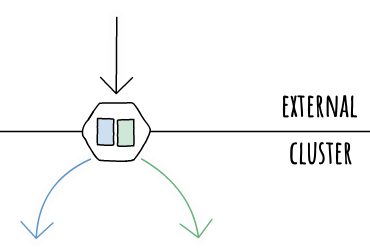

# Kubernetes Basics

**NOTE:** this is a work in progress


This is a basic repo to host the simple k8s projects I work on as I learn the technology.

It will contain the practical work from the notes created at: https://ns1.ovh/k8s/overview/.

## What is kubernetes

Kubernetes is an orchestration tool for container technologies, mainly docker.

## Why is Kubernetes used

Docker allows a process to run in an isolated container, bundled with its dependencies. However with docker, these containers need to be managed individually.

Kubernetes manages these containers at scale, assigning them to orchestration groups to manage their replication and availability. With these orchestration groups in place, the groups of containers become highly available and fault tolerant.

## Kubernetes Components


### Pods

Pods are the smallest component that Kubernetes manages.


These can be comprised of one or more containers (usually one).

You will usually find more containers in a pod if you have a custom logging or monitoring system.


### Deployments


A deployment is how we manage groups of pods. 

Pods are usually configured as a template and assigned to a `Replica Set`, then the replica set is deployed using a deployment. 

This allows us to deploy multiple copies of a pod for high availability.


### Logical overview

This is the logical heirarchy of a kubernetes cluster.


This is what the major components of a Kubernetes cluster looks like.

This layout is the hierarchy in which they would be declared in your manifests.

The main point about this diagram is that networking is not included. Networking has a much simpler layout that we will go into later.


### Physical overview

This is the physical heirarchy of a kubernetes cluster.


Here we see how a deployment similar to the logical view fits into the physical world.

This cluster uses two nodes which aren’t shown on the logical diagram.

You can see two deployments of two pods. Kubernetes will attempt to schedule the pods in any given deployment on different nodes, this is to ensure that a failure in a node doesn’t result in a failure in the application. 


### Networking


Deployments and containers have no part in networking.

It's done between the *Ingress*, *Services* and the *Pods*


#### Ingress

 -->

Ingress is the network entry point to your internal cluster network.

It contains routing rules to ensure network traffic is routed to the correct locations.

Public Cloud platforms will usually have their own Ingress controller that integrate effectively with their underlying infrastructure. Most Ingress controllers run nginx.

#### Services

Services are how we assign networking to a pod.


This is done by assigning a label to the pod in the format `key:value`: 
```
template:
  metadata:
    labels:
      key: value
```

The service then attached itself to those pods by using a selector:
```
spec:
  selector:
    key: value
```

There are several types of services that can be deployed the descriptions below are taken from the [Kubernetes Documentation](https://kubernetes.io/docs/concepts/services-networking/service/):

- **ClusterIP:** Exposes the Service on a cluster-internal IP. Choosing this value makes the Service only reachable from within the cluster. This is the default ServiceType.
- **NodePort:** Exposes the Service on each Node’s IP at a static port (the NodePort). A ClusterIP Service, to which the NodePort Service routes, is automatically created. You’ll be able to contact the NodePort Service, from outside the cluster, by requesting <NodeIP>:<NodePort>.
- **LoadBalancer:** Exposes the Service externally using a cloud provider’s load balancer. NodePort and ClusterIP Services, to which the external load balancer routes, are automatically created.
- **ExternalName:** Maps the Service to the contents of the externalName field (e.g. foo.bar.example.com), by returning a CNAME record with its value. No proxying of any kind is set up.


## How is kubernetes used

Like most orchestration tools, a kubernetes deployment is defined in a number of manifests. These manifests describe the desired state of a kubernetes application.

These desired states are given to the control plane, which manages the cluster. The desired state of the cluster is applied with what's known as a **control loop**:


This takes the desired state of the cluster and observes the current state, if there is a difference, it acts to apply the changes. Once the changes are applied it restarts the loop, observing the current state comparing it against the desired state, ensuring it's constantly staying up to date and that no configuration drift has occurred.


## kubectl

Command line tool for Kubernetes

This is what we will use to manage our cluster

For details or help with commands:

```
kubectl --help
kubectl --options
```


### kubectl get

Display one or many resources

Commonly used for:

- pod(s)
- deployment(s)
- svc (services)

```
kubectl get [resource]
```


### kubectl apply

Apply a configuration to a resource

Usually done with the -f flag to specify a manifest file

```
kubectl apply -f [file.yml]
```


### kubectl delete

Delete resources by:

- file
- name
- selector

```
kubectl delete -f [file.yml]
```


### kubectl exec

Execute a command in a container

```
kubectl exec -it [pod] -- [command]
```


## Tasks

- [00 - k8s cluster setup](https://github.com/mrmcshane/k8s-training/tree/master/00-k8s-cluster-setup)
- [01 - simple application](https://github.com/mrmcshane/k8s-training/tree/master/01-simple-application)
- [02 - multi container pod](https://github.com/mrmcshane/k8s-training/tree/master/02-multi-container-pod)
- [03 - stateful application](https://github.com/mrmcshane/k8s-training/tree/master/03-stateful-application)
- [04 - namespaces](https://github.com/mrmcshane/k8s-training/tree/master/04-namespaces)
- [05 - helm](https://github.com/mrmcshane/k8s-training/tree/master/05-helm)
- [0x - database cluster](https://github.com/mrmcshane/k8s-training/tree/master/0x-database-cluster)
- [0x - ingress](https://github.com/mrmcshane/k8s-training/tree/master/0x-ingress)
- [0x - istio](https://github.com/mrmcshane/k8s-training/tree/master/0x-istio)

This is not complete and will be changed/updated as I go.
The `0x` headers are for planned work, may or may not happen. 
